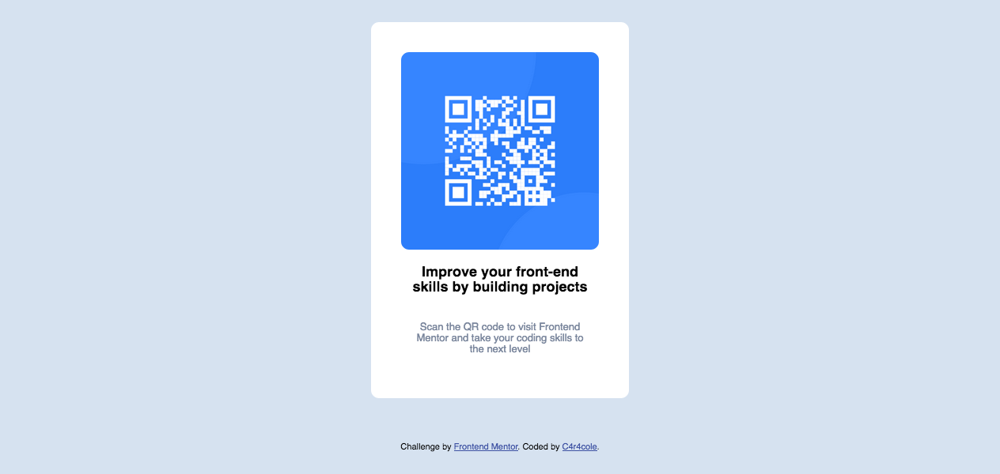

# Frontend Mentor - QR code component solution

This is a solution to the [QR code component challenge on Frontend Mentor](https://www.frontendmentor.io/challenges/qr-code-component-iux_sIO_H). Frontend Mentor challenges help you improve your coding skills by building realistic projects.

## Table of contents

- [Overview](#overview)
  - [Screenshot](#screenshot)
  - [Built with](#built-with)
  - [What I learned](#what-i-learned)
  - [Continued development](#continued-development)
  - [Useful resources](#useful-resources)
- [Author](#author)

## Overview

This is the first project I am doing on frontend Mentor !

### Screenshot



### Built with

- Semantic HTML5 markup
- CSS custom properties
- Flexbox
- Mobile-first workflow

### What I learned

I learned to use flexboxes better !

```css
.blockCode {
  display: flex;
  flex-direction: column;
  justify-content: space-around;
  font-size: 11px;
  text-align: center;
  padding: 3%;
  background: white;
  width: 250px;
  height: 400px;
  border-radius: 10px;
}
```

### Continued development

Changing the background color when clicked... why not?!

### Useful resources

- [Example resource 1](https://www.codeur.com/tuto/css/centrer-div-css/#:~:text=Il%20est%20possible%20aussi%20de,%3A%20utiliser%20la%20position%3A%20absolute%20.&text=Avec%20cette%20position%2C%20top%20et,%2C%20et%2050%25%20%C3%A0%20gauche.) - This helped me for Xa better understanding of flexboxes
- [Example resource 2](https://css-tricks.com/snippets/css/a-guide-to-flexbox/) - This helped me for Xa better understanding of flexboxes

## Author

- Website - [C4r4cole](https://www.your-site.com)
- Frontend Mentor - [@yourusername](https://www.frontendmentor.io/profile/yourusername)
- Twitter - [@yourusername](https://www.twitter.com/yourusername)
